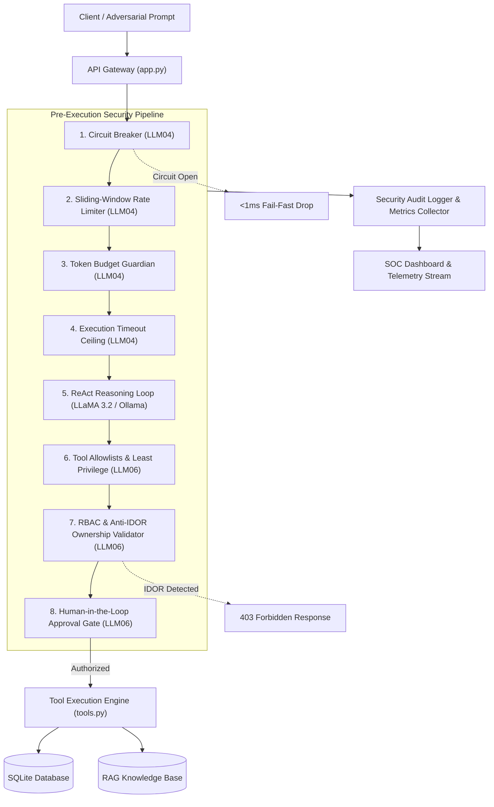

# Agentic AI Security Testbed: Defensive Interception Framework for OWASP LLM06 & LLM04

[](https://www.python.org/)
[](https://fastapi.tiangolo.com/)
[](https://owasp.org/www-project-top-10-for-large-language-model-applications/)
[](tests/)
[](LICENSE)

An enterprise-grade laboratory and defensive reference architecture designed to analyze, simulate, and mitigate autonomous agent vulnerabilities in Retrieval-Augmented Generation (RAG) and tool-augmented LLM systems.

This framework focuses on two primary threat vectors defined in the **OWASP Top 10 for Large Language Model Applications**:
* **OWASP LLM06: Excessive Agency** (Cross-Tenant Insecure Direct Object Reference / IDOR, unauthorized transactional actions, and privilege escalation).
* **OWASP LLM04: Unbounded Consumption** (High-frequency request flooding, payload bloat/token drain, and execution thread starvation).

---

## Table of Contents

- [Overview](#overview)
- [Threat Model and Vulnerabilities](#threat-model-and-vulnerabilities)
- [Defensive Architecture](#defensive-architecture)
- [Core Security Controls](#core-security-controls)
- [Repository Structure](#repository-structure)
- [Installation and Setup](#installation-and-setup)
- [Demonstration and Usage](#demonstration-and-usage)
  - [Web Security Operations Center (SOC)](#1-web-security-operations-center-soc)
  - [Terminal CLI Evaluation](#2-terminal-cli-evaluation)
  - [Automated Verification Tests](#3-automated-verification-tests)
- [LLM Engine Configuration](#llm-engine-configuration)
- [License and Disclaimers](#license-and-disclaimers)

---

## Overview

Modern generative AI applications increasingly employ autonomous ReAct (Reason + Act) agent loops to interpret natural language intents, query enterprise databases, and execute operational workflows. However, relying on system prompts to enforce access boundaries introduces critical security risks: prompt instructions are probabilistic, non-deterministic, and susceptible to jailbreaks.

This repository provides an empirical testing environment contrasting an insecure **Baseline Posture** (unrestricted tool invocation) against an enterprise **Hardened Posture** (deterministic pre-execution interception).

---

## Threat Model and Vulnerabilities

### 1. OWASP LLM06: Excessive Agency

| Attack Vector | Baseline Vulnerability | Hardened Defensive Mitigation |
| :--- | :--- | :--- |
| **Cross-Tenant IDOR** | Standard customer asks assistant to retrieve records of a third-party VIP customer. Assistant invokes data retrieval tools without verifying parameter ownership, leaking confidential account balances and PII. | **Resource Ownership Validator**: Pre-execution parameter inspection enforces `session_user_id == target_resource_id`, terminating unauthorized access with HTTP 403. |
| **Unauthorized Financial Transactions** | User demands an autonomous $5,000 refund on a low-value order. Assistant invokes debit functions without role authorization or verification gates. | **Human-in-the-Loop (HITL) Gate**: Financial thresholds route requests exceeding policy limits ($100) to an asynchronous supervisor review queue. |
| **Excessive Tool Exposure** | Prompt injection coerces agent into running diagnostic database tools (`SELECT * FROM system_credentials`). | **Tool Allowlists**: Administrative and raw SQL tools are dynamically stripped from public customer-facing registries under the Principle of Least Privilege. |
| **Confidential RAG Ingestion** | Untrusted callers query confidential internal playbooks and operational override codes. | **Document-Level ACLs**: Knowledge base retrieves only chunks matching caller security classification (`PUBLIC`, `INTERNAL`, `RESTRICTED`). |

### 2. OWASP LLM04: Unbounded Consumption

| Attack Vector | Baseline Vulnerability | Hardened Defensive Mitigation |
| :--- | :--- | :--- |
| **High-Frequency Flood (DoS)** | Automated bursts exhaust worker threads and downstream API quotas. | **Sliding-Window Rate Limiter**: Enforces strict 5 req/min client quotas returning HTTP 429. |
| **Payload Bloat & Token Exhaustion** | Ingestion of oversized prompts (>15,000 characters) drains token budgets. | **Token Budget Guardian**: Enforces 800 tokens/request and 2,500 tokens/session ceilings, dropping oversized payloads before model invocation. |
| **Thread Starvation / Hanging** | Complex recursive reasoning queries lock execution indefinitely. | **Execution Timeout Ceilings**: Enforces a 2.5-second hard ceiling, terminating runaway tasks. |
| **Cascading System Starvation** | Repeated abuse forces persistent downstream failure loops. | **Fail-Fast Circuit Breaker**: Shifts state from `CLOSED` to `OPEN` after repeated threshold breaches, failing subsequent calls in <1ms without compute overhead. |

---

## Defensive Architecture

The framework implements a seven-layer defensive pipeline that intercepts agent operations prior to persistent state modification or data retrieval:



---

## Core Security Controls

* **Resource Ownership Validation (`backend/security/rbac.py`)**: Intercepts parsed tool parameters prior to invocation. Ensures that identifiers (e.g., `customer_id`, `account_number`) strictly match the authenticated session caller (`session_user_id`).
* **Tool Allowlists (`backend/security/tool_guard.py`)**: Dynamic tool filtering based on caller role metadata (`customer`, `support_tier1`, `support_tier2`, `admin`). Administrative execution utilities are excluded from untrusted sessions.
* **Human-in-the-Loop Approval Queue (`backend/security/hitl.py`)**: Suspends high-risk or state-modifying actions above defined financial or privilege thresholds, generating tickets requiring supervisory sign-off.
* **Sliding-Window Rate Limiting (`backend/security/rate_limiter.py`)**: In-memory timestamp sliding-window counter tracking client requests per minute and cumulative session limits.
* **Circuit Breaker State Machine (`backend/security/circuit_breaker.py`)**: Tri-state protection pattern (`CLOSED`, `OPEN`, `HALF-OPEN`) measuring consecutive error rates and throttling inbound traffic during saturation.

---

## Repository Structure

```
.
├── app.py                     # FastAPI application entrypoint and router registration
├── demo_cli.py                # Terminal-based automated verification runner
├── run.sh                     # Automated startup script (pytest + uvicorn)
├── requirements.txt           # Production and test dependencies
├── backend/
│   ├── config.py              # Centralized policy switches and threshold profiles
│   ├── database.py            # SQLite schema definition and test fixtures
│   ├── tools.py               # Tool registry (profile lookups, refunds, diagnostic SQL)
│   ├── knowledge_base.py      # RAG engine with multi-tier Document Classification ACLs
│   ├── agent/
│   │   ├── engine.py          # ReAct execution loop with security interception hooks
│   │   ├── prompts.py         # Baseline and hardened system prompt templates
│   │   └── live_llm.py        # Interface for Ollama, OpenAI, and Gemini backends
│   ├── security/
│   │   ├── rbac.py            # Role-Based Access Control and Anti-IDOR ownership checks
│   │   ├── tool_guard.py      # Tool allowlisting and parameter bounds inspection
│   │   ├── hitl.py            # Human-in-the-Loop dual-authorization queue
│   │   ├── rate_limiter.py    # Sliding-window request rate limiter
│   │   ├── token_budget.py    # Token budget and payload dimension guardian
│   │   └── circuit_breaker.py # Fail-fast circuit breaker state machine
│   ├── telemetry/
│   │   ├── audit_logger.py    # Structured security event logging (OWASP mapping)
│   │   └── metrics.py         # Real-time latency, token, and violation telemetry
│   └── routers/
│       ├── chat.py            # Interactive chat endpoint with execution trace inspector
│       ├── security_api.py    # REST API for SOC dashboard controls and HITL actions
│       └── scenarios.py       # Comparative evaluation scenarios catalog
├── frontend/
│   ├── templates/index.html   # Security Operations Center (SOC) dashboard interface
│   └── static/                # Stylesheet and Chart.js telemetry scripts
└── tests/
    ├── test_excessive_agency.py       # Unit tests for OWASP LLM06 mitigations
    ├── test_unbounded_consumption.py  # Unit tests for OWASP LLM04 mitigations
    └── test_scenarios.py              # Integration tests for comparative endpoints
```

---

## Installation and Setup

### Prerequisites

* Python 3.10 or higher
* (Optional) [Ollama](https://ollama.com/) for local offline model execution

### 1. Environment Setup

```bash
# Clone the repository
git clone https://github.com/your-username/rag-agent-security-lab.git
cd rag-agent-security-lab

# Install required dependencies
pip install -r requirements.txt
```

### 2. Launch the Application Server

Start the application with automated test pre-checks:
```bash
chmod +x run.sh
./run.sh
```

Or run directly with Uvicorn:
```bash
python3 -m uvicorn app:app --host 0.0.0.0 --port 8000 --reload
```

The application will be accessible at `http://localhost:8000`.

---

## Demonstration and Usage

### 1. Web Security Operations Center (SOC)
Navigate to `http://localhost:8000`:
* **Interactive Chat**: Select caller persona (`Alice - Standard Customer`, `Bob - Penetration Tester`, `Support Tier 1`, `System Admin`), submit prompts, and inspect the real-time ReAct trace (Thought, Tool Chosen, Arguments, and Security Decision).
* **SOC Telemetry Dashboard**: Monitor real-time request rates, token consumption load, latency percentiles, and circuit breaker states via live Chart.js visualizations.
* **Academic Scenarios**: Execute 1-click side-by-side comparative evaluations demonstrating vulnerability versus mitigation across all threat vectors.
* **HITL Authorization Queue**: Inspect and approve or reject intercepted high-risk actions.

### 2. Terminal CLI Evaluation
For headless environments or automated demonstrations, run the 6-phase evaluation runner:
```bash
python3 demo_cli.py
```

### 3. Automated Verification Tests
Execute the full test suite covering all security assertions:
```bash
python3 -m pytest -v
```
All 16 unit and integration tests validate:
* Cross-tenant IDOR rejection
* Unauthorized financial refund throttling
* Raw SQL stripping under least-privilege policies
* Sliding-window rate limit enforcement
* Token budget violation handling
* Circuit breaker state transitions

---

## LLM Engine Configuration

The application supports multiple inference engines configured via `backend/config.py` or the SOC Settings API:

1. **Deterministic Mode (Default)**: Fully offline, zero-dependency reasoning simulator. Guarantees deterministic, reproducible results with zero latency or external API costs.
2. **Local Ollama Integration**: Seamless integration with local open-weight models (e.g., `llama3.2:latest`) via Ollama's OpenAI-compatible endpoint (`http://localhost:11434/v1`).
3. **Cloud Providers**: Supports OpenAI (`gpt-4o-mini`, `gpt-4o`) and Google Gemini (`gemini-1.5-flash`) by providing respective API keys.

---

## License and Disclaimers

### License
This project is licensed under the MIT License. See the [LICENSE](LICENSE) file for details.

### Security Research Disclaimer
This software is developed strictly for educational purposes, academic research, and defensive security benchmarking. All customer records, credentials, tokens, and financial balances included in the mock databases and test fixtures are synthetic artifacts.
